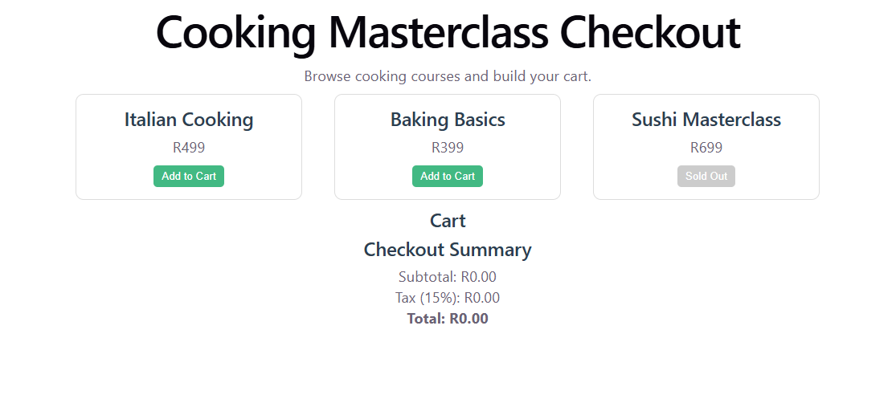

# Cooking Masterclass Catalogue

## Project Overview

This is a Vue 3 single-page application for browsing cooking masterclass courses.  
Users can view courses, see chef details, pricing, and skill levels, check availability, and save courses to a wishlist.

---

## Features

- Dynamic course listing using Vue `v-for`
- Sold out / available status using `v-if / v-else`
- Wishlist functionality with counter
- Save courses with interactive buttons
- Responsive card layout for mobile and desktop
- Clean, minimal cooking-themed UI

---

## Technologies Used

- Vue 3
- Vite
- JavaScript
- HTML
- CSS

---

## Installation

```bash
npm install
```

## Run Project

```bash
npm run dev
```

## Screenshot


